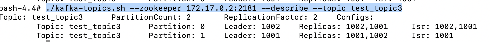
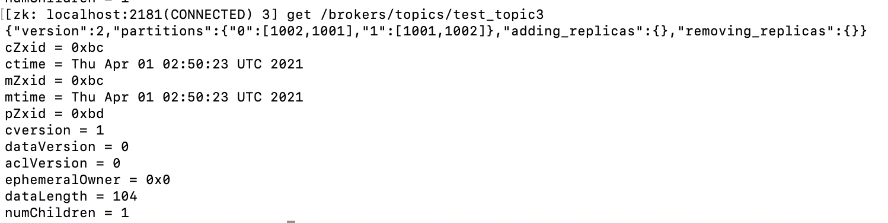

# go-Kafka
此demo是学习和创建分布式kafka系统，运行环境为docker  
## 安装镜像
sudo docker pull wurstmeister/zookeeper  
sudo docker pull wurstmeister/kafka  
## 启动容器
1. zookeeper启动:  
    ```
    docker run -d  -p 2181:2181 --name zookeeper wurstmeister/zookeeper  
    备注：2181 为zookeeper对外开放端口，如果需要修改，执行docker exec -it (zookeeper启动容器id) /bin/bash,修改conf/zoo.cfg 
    配置文件  
    ```

2. 启动第一个broker:   
    ``` 
    docker run -d -p 9092:9092 --link zookeeper --env KAFKA_ZOOKEEPER_CONNECT=zookeeper:2181 --env  KAFKA_ADVERTISED_HOST_NAME=127.0.0.1 --env  
    KAFKA_ADVERTISED_PORT=9092 wurstmeister/kafka:latest  
    ```

3. 启动第二个broker:    
    ```
   docker run -d -p 9093:9093 --link zookeeper --env KAFKA_ZOOKEEPER_CONNECT=zookeeper:2181 --env  KAFKA_ADVERTISED_HOST_NAME=127.0.0.1 --env  
   KAFKA_ADVERTISED_PORT=9093 wurstmeister/kafka:9093  
   ```

## 查看信息
1. 查看zookeeper下broker节点数量  
    ```
    执行docker exec -it (zookeeper启动容器id) /bin/bash      
    进入bin/目录下，执行zkCli.sh，在执行 ls /brokers/ids即可查看    
    ```

2. 查看分区分区分配方案  
   

3. 查看主题分区分配细节  
     
